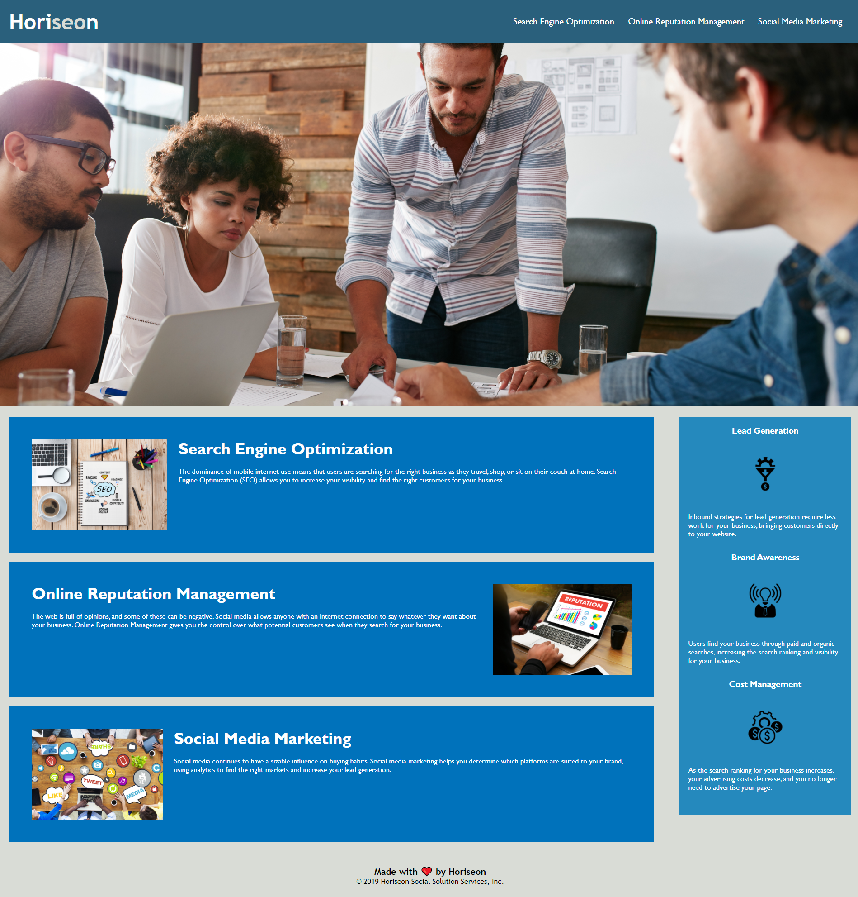

# Horiseone Social Solution Service, Inc.

## Task 

As a junior developer, I've been tasked with refactoring Horiseon's website. My task is to ensure that the website meets accessibility standard. In order to  accomplish this, I've make amend to the HTML and CSS files. I also added a reset file in case the content need to reformat.

## Changes on HTML file

* implemented Semantic HTML elements
* included alt attributes to image elements
* corrected the structure of HTML elements so they follow a logical structure
* added a descriptive title
* made sure all links work properly

## Changes made on CSS file

* consolidated CSS selectors and properties
* organized CSS file to follow semantic structure
* properly commented the CSS file

#### Below is a link to the finished product along with a screengrab of the full Webpage

Click on Link-->[Horiseon](https://vinhkhamhuynh.github.io/vinhkhamhuynh-refactor/)

